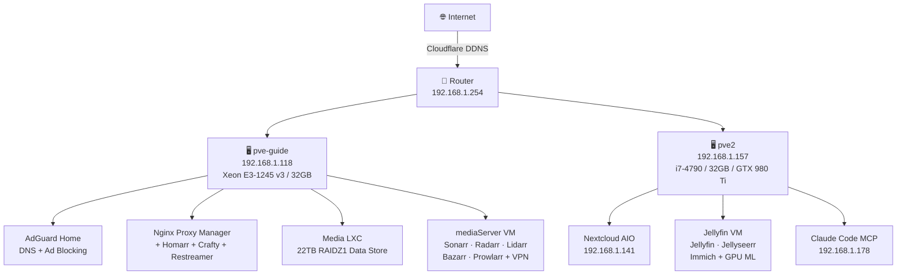

# Taylor's Homelab

A two-node Proxmox VE cluster running a full self-hosted stack — media, photos, cloud storage, game servers, and more. Built around the philosophy of owning your own data and services.

## Cluster Overview

## Quick Reference

| Service | URL | Host |
|---|---|---|
| Proxmox UI | `proxmox.taylorsfunlab.com` | pve-guide |
| Dashboard | `home.taylorsfunlab.com` | portainer CT |
| Jellyfin | `stream.taylorsfunlab.com` | jellyfin VM |
| Jellyseerr | port 5055 | jellyfin VM |
| Immich | port 2283 | jellyfin VM |
| Nextcloud | `nc.taylorsfunlab.com` | nextcloud CT |
| Sonarr | `sonarr.taylorsfunlab.com` | mediaServer VM |
| Radarr | `radarr.taylorsfunlab.com` | mediaServer VM |
| AdGuard | port 6060 | adguard CT |
| Portainer | `proxy.taylorsfunlab.com` | portainer CT |
| Crafty | `crafty.taylorsfunlab.com` | portainer CT |

## IP Scheme

| Host | IP |
|---|---|
| Router | 192.168.1.254 |
| pve-guide | 192.168.1.118 |
| pve2 | 192.168.1.157 |
| adguard CT | DHCP |
| portainer CT | 192.168.1.122 |
| media CT | 192.168.1.200 |
| mediaServer VM | 192.168.1.120 |
| nextcloud CT | 192.168.1.141 |
| claude CT | 192.168.1.178 |
| jellyfin VM | DHCP |

## What's Running

### Media
- **Jellyfin** — media server with hardware transcoding
- **Immich** — Google Photos replacement with GPU-accelerated facial recognition (GTX 980 Ti)
- **Jellyseerr** — media request management
- **Jellystat** — Jellyfin analytics
- **Sonarr / Radarr / Lidarr** — automated media management
- **Bazarr** — subtitle management
- **Prowlarr** — indexer aggregation
- **Profilarr** — quality profile management
- **Sportarr** — sports content management
- **qBittorrent + NZBGet** — download clients (VPN-routed via Gluetun)

### Cloud & Productivity
- **Nextcloud AIO** — full cloud suite with Collabora, Talk, Fulltextsearch, Whiteboard

### Network
- **AdGuard Home** — network-wide DNS ad blocking
- **Nginx Proxy Manager** — reverse proxy with Let's Encrypt SSL
- **Cloudflare DDNS** — dynamic DNS for `taylorsfunlab.com`

### Management
- **Proxmox VE** — hypervisor cluster management
- **Portainer** — Docker container management
- **Homarr** — homelab dashboard
- **Claude Code MCP** — AI-assisted cluster management

### Gaming
- **Crafty Controller** — Minecraft server management (Java + Bedrock)
- **AMP** — multi-game server manager (stopped)
