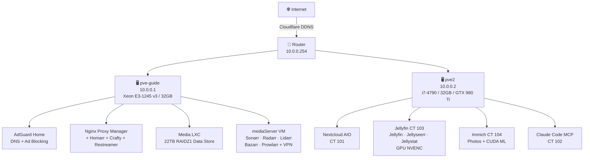

# Taylor's Homelab

A two-node Proxmox VE cluster running a full self-hosted stack — media, photos, cloud storage, game servers, and more. Built around the philosophy of owning your own data and services.

## Cluster Overview

```mermaid
graph TD
    Internet["🌐 Internet"] -->|Cloudflare DDNS| Router["🔀 Router\n10.0.0.254"]
    Router --> PVE1["🖥️ pve-guide\n10.0.0.1\nXeon E3-1245 v3 / 32GB"]
    Router --> PVE2["🖥️ pve2\n10.0.0.2\ni7-4790 / 32GB / GTX 980 Ti"]

    PVE1 --> AG["AdGuard Home\nDNS + Ad Blocking"]
    PVE1 --> NPM["Nginx Proxy Manager\n+ Homarr + Crafty + Restreamer"]
    PVE1 --> MEDIA["Media LXC\n22TB RAIDZ1 Data Store"]
    PVE1 --> ARR["mediaServer VM\nSonarr · Radarr · Lidarr\nBazarr · Prowlarr + VPN"]

    PVE2 --> NC["Nextcloud AIO\nCT 101"]
    PVE2 --> JF["Jellyfin CT 103\nJellyfin · Jellyseerr · Jellystat\nGPU NVENC"]
    PVE2 --> IMMICH["Immich CT 104\nPhotos + CUDA ML"]
    PVE2 --> CLAUDE["Claude Code MCP\nCT 102"]
```

## Quick Reference

| Service | Host |
|---|---|
| Proxmox UI | pve-guide |
| Dashboard (Homarr) | portainer CT |
| Jellyfin | jellyfin CT (CT 103) |
| Jellyseerr | jellyfin CT (CT 103) |
| Immich | immich CT (CT 104) |
| Nextcloud | nextcloud CT (CT 101) |
| Sonarr / Radarr / Lidarr | mediaServer VM |
| AdGuard | adguard CT (CT 100) |
| Portainer | portainer CT (CT 121) |
| Crafty | portainer CT (CT 121) |

> Public-facing hostnames are fronted by Nginx Proxy Manager with Let's Encrypt SSL. Specific subdomain → backend mappings are intentionally not published.

## IP Scheme

| Host | IP |
|---|---|
| Router | 10.0.0.254 |
| pve-guide | 10.0.0.1 |
| pve2 | 10.0.0.2 |
| adguard CT | DHCP |
| portainer CT | 10.0.0.11 |
| media CT | 10.0.0.20 |
| mediaServer VM | 10.0.0.10 |
| nextcloud CT | 10.0.0.12 |
| claude CT | 10.0.0.13 |
| jellyfin CT (CT 103) | 10.0.0.14 |
| immich CT (CT 104) | 10.0.0.15 |

## What's Running

### Media
- **Jellyfin** — media server with hardware transcoding
- **Immich** — Google Photos replacement with GPU-accelerated facial recognition (GTX 980 Ti)
- **Jellyseerr** — media request management
- **Jellystat** — Jellyfin analytics
- **Sonarr / Radarr / Lidarr** — automated media management
- **Bazarr** — subtitle management
- **Prowlarr** — indexer aggregation
- **Profilarr** — quality profile management
- **Sportarr** — sports content management
- **qBittorrent + NZBGet** — download clients (VPN-routed via Gluetun)

### Cloud & Productivity
- **Nextcloud AIO** — full cloud suite with Collabora, Talk, Fulltextsearch, Whiteboard
- **Vaultwarden** — self-hosted Bitwarden-compatible password manager (private)
- **Internal wiki** — long-term documentation archive (private)

### Network
- **AdGuard Home** — network-wide DNS ad blocking
- **Nginx Proxy Manager** — reverse proxy with Let's Encrypt SSL
- **Cloudflare DDNS** — dynamic DNS for the home IP

### Monitoring & Management
- **Proxmox VE** — hypervisor cluster management
- **Portainer** — Docker container management
- **Homarr** — homelab dashboard
- **Uptime Kuma** — service uptime + alerting
- **Filebrowser** — host-level filesystem access on each node
- **Apache Guacamole** — browser-based RDP/VNC gateway
- **Claude Code MCP** — AI-assisted cluster management

### Other
- **Restreamer** — RTMP/HLS live-stream relay
- **Windows 11 VM** — for Windows-only browser tasks
- **Crafty Controller** — Minecraft server management (Java + Bedrock)
- **AMP** — multi-game server manager (stopped)
- **Autonomous Trading Bot** — Claude-driven paper-trading bot (overview only — see [Trading Bot](services/automation/trading-bot.md))
