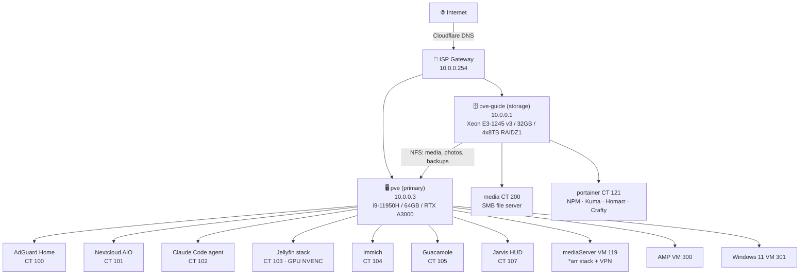

# Taylor's Homelab

A two-node Proxmox VE cluster running a full self-hosted stack: media, photos, cloud storage, game servers, and a layer of AI-assisted operations (an in-cluster Claude Code agent that monitors, heals, and documents the lab). It's built on the idea of owning your own data and services.

!!! info "Current layout (since mid-2026)"
    The cluster was rebuilt around a laptop. **`pve`** (an i9 mobile workstation with an RTX A3000) now runs almost every workload. **`pve-guide`** (the original Xeon server) holds the 4-drive RAIDZ1 array, the backups, and the containers tied to that array. The old GPU node, `pve2`, was decommissioned in July 2026. See [Hardware](hardware/index.md) for the history.

## Cluster Overview

```mermaid
graph TD
    Internet["🌐 Internet"] -->|Cloudflare DNS| Router["🔀 ISP Gateway\n10.0.0.254"]
    Router --> PVE["🖥️ pve (primary)\n10.0.0.3\ni9-11950H / 64GB / RTX A3000"]
    Router --> GUIDE["🗄️ pve-guide (storage)\n10.0.0.1\nXeon E3-1245 v3 / 32GB / 4x8TB RAIDZ1"]

    PVE --> AG["AdGuard Home\nCT 100"]
    PVE --> NC["Nextcloud AIO\nCT 101"]
    PVE --> CLAUDE["Claude Code agent\nCT 102"]
    PVE --> JF["Jellyfin stack\nCT 103 · GPU NVENC"]
    PVE --> IM["Immich\nCT 104"]
    PVE --> GUAC["Guacamole\nCT 105"]
    PVE --> JAR["Jarvis HUD\nCT 107"]
    PVE --> ARR["mediaServer VM 119\n*arr stack + VPN"]
    PVE --> AMP["AMP VM 300"]
    PVE --> WIN["Windows 11 VM 301"]

    GUIDE --> MEDIA["media CT 200\nSMB file server"]
    GUIDE --> PORT["portainer CT 121\nNPM · Kuma · Homarr · Crafty"]
    GUIDE -->|NFS: media, photos, backups| PVE
```

## Quick Reference

| Service | Host | Node |
|---|---|---|
| Proxmox UI | both nodes (port 8006) | pve, pve-guide |
| Dashboard (Homarr) | portainer CT (CT 121) | pve-guide |
| Uptime Kuma | portainer CT (CT 121) | pve-guide |
| Nginx Proxy Manager | portainer CT (CT 121) | pve-guide |
| Crafty | portainer CT (CT 121) | pve-guide |
| Media file server (SMB) | media CT (CT 200) | pve-guide |
| AdGuard | adguard CT (CT 100) | pve |
| Nextcloud | nextcloud CT (CT 101) | pve |
| Claude Code agent | claude CT (CT 102) | pve |
| Jellyfin / Jellyseerr / Jellystat | jellyfin CT (CT 103) | pve |
| Immich | immich CT (CT 104) | pve |
| Guacamole | guacamole CT (CT 105) | pve |
| Jarvis HUD | jarvis CT (CT 107) | pve |
| Sonarr / Radarr / Lidarr / Prowlarr | mediaServer VM (VM 119) | pve |
| AMP | amp-gameserver VM (VM 300) | pve |
| Windows 11 | windows11-browser VM (VM 301) | pve |

> Public-facing hostnames go through Nginx Proxy Manager with Let's Encrypt SSL. The specific subdomain → backend mappings are deliberately not published.

## IP Scheme

Addresses on this site are placeholders (`10.0.0.x`). They don't match the real LAN. Every guest in the list below has a fixed address, either a static config or a pinned lease.

| Host | IP |
|---|---|
| ISP gateway | 10.0.0.254 |
| pve-guide | 10.0.0.1 |
| pve | 10.0.0.3 |
| adguard CT (100) | 10.0.0.5 |
| mediaServer VM (119) | 10.0.0.10 |
| portainer CT (121) | 10.0.0.11 |
| nextcloud CT (101) | 10.0.0.12 |
| claude CT (102) | 10.0.0.13 |
| jellyfin CT (103) | 10.0.0.14 |
| immich CT (104) | 10.0.0.15 |
| guacamole CT (105) | 10.0.0.16 |
| amp-gameserver VM (300) | 10.0.0.17 |
| windows11 VM (301) | 10.0.0.18 |
| jarvis CT (107) | 10.0.0.19 |
| media CT (200) | 10.0.0.20 |

## What's Running

### Media
- **Jellyfin**: media server with NVENC hardware transcoding (RTX A3000)
- **Immich**: Google Photos replacement with GPU-accelerated facial recognition and smart search
- **Jellyseerr** (Seerr): media request management
- **Jellystat**: Jellyfin analytics
- **Sonarr / Radarr / Lidarr**: automated media management
- **Bazarr**: subtitle management
- **Prowlarr**: indexer aggregation
- **Profilarr**: quality profile management
- **Sportarr**: sports content management
- **qBittorrent + NZBGet**: download clients, routed through a VPN via Gluetun

### Cloud & Productivity
- **Nextcloud AIO**: full cloud suite with Collabora, Talk, full-text search, and Whiteboard
- **Vaultwarden**: self-hosted, Bitwarden-compatible password manager (private)
- **Obsidian vault**: long-term homelab knowledge base in git-tracked markdown, maintained by the Claude agent (private)

### Network
- **AdGuard Home**: DNS ad blocking and internal DNS rewrites
- **Nginx Proxy Manager**: reverse proxy with a wildcard Let's Encrypt certificate
- **Cloudflare DDNS**: dynamic DNS for the home IP
- **Tailscale**: remote access (subnet router + exit node)

### Monitoring & Management
- **Proxmox VE**: hypervisor cluster
- **Portainer**: Docker container management
- **Homarr**: homelab dashboard
- **Uptime Kuma**: 42 monitors, with alerts to Discord and email that feed the self-healing pipeline
- **Filebrowser**: host-level filesystem access on each node
- **Apache Guacamole**: browser-based RDP/VNC gateway
- **Nightly vzdump backups** of every guest (see [Backups](infrastructure/backups.md))

### AI & Automation
- **Claude Code agent**: runs in CT 102 and manages the cluster over the Proxmox API (MCP)
- **Self-healing**: Kuma alerts trigger a headless Claude run that is limited to an allowlist of fixes
- **Byte**: a Discord bot that is also a full Claude Code agent, with voice mode
- **Jarvis HUD**: LAN dashboard with a "hey Jarvis" voice assistant
- **Weekly health audit**: HTML email covering SMART, ZFS, GPU, backups, and monitoring coverage
- **Trading bots**: two paper-trading research bots (overview only, see [Trading Bots](services/automation/trading-bot.md))

### Other
- **Restreamer**: RTMP/HLS live-stream relay
- **Windows 11 VM**: for Windows-only browser tasks
- **Crafty Controller**: Minecraft server management (Java + Bedrock)
- **AMP**: multi-game server manager
