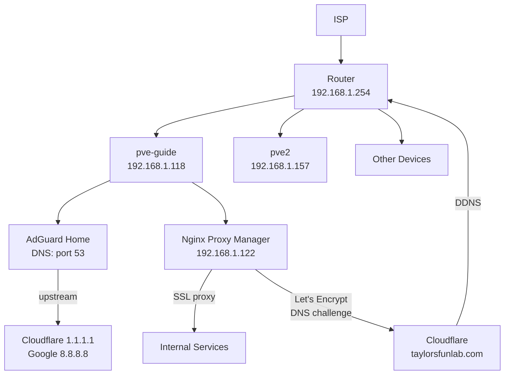

# Network

## Topology

Flat `/24` home network. All devices on `192.168.1.0/24`. AdGuard Home handles DNS for the whole network.

## DNS — AdGuard Home

- **Container:** CT 100 on pve-guide
- **DNS port:** 53
- **Web UI:** port 6060
- **Upstream DNS:** Cloudflare (1.1.1.1) + Google (8.8.8.8)
- **Function:** Network-wide ad and tracker blocking

All devices on the network use AdGuard as their DNS server (set via router DHCP).

## Reverse Proxy — Nginx Proxy Manager

- **Container:** CT 121 (portainer LXC) on pve-guide
- **IP:** 192.168.1.122

Handles all external access to services via `taylorsfunlab.com` subdomains. Wildcard SSL certificate (`*.taylorsfunlab.com`) issued via Let's Encrypt with Cloudflare DNS challenge — no ports exposed to the internet except 80/443.

### Proxy Hosts

| Subdomain | Backend | Port |
|---|---|---|
| `home.taylorsfunlab.com` | 192.168.1.122 | 7575 (Homarr) |
| `crafty.taylorsfunlab.com` | 192.168.1.122 | 8123 (Crafty) |
| `proxy.taylorsfunlab.com` | 192.168.1.122 | NPM itself |
| `proxmox.taylorsfunlab.com` | 192.168.1.118 | 8006 |
| `nc.taylorsfunlab.com` | 192.168.1.141 | 11000 (Nextcloud) |
| `radarr.taylorsfunlab.com` | 192.168.1.120 | 7878 |
| `sonarr.taylorsfunlab.com` | 192.168.1.120 | 8989 |

## Dynamic DNS — Cloudflare

Cloudflare DDNS container runs in the portainer LXC and keeps the `taylorsfunlab.com` A record pointed at the home IP. Updates automatically when the IP changes.

## VPN — Gluetun

All download traffic on the mediaServer VM is routed through a VPN via Gluetun. qBittorrent, NZBGet, and Prowlarr run with `network_mode: service:gluetun` — they have no direct internet access and cannot leak traffic if the VPN drops.

## Static IPs

Most containers use DHCP but the following have consistent IPs (either static or DHCP reservation):

| Host | IP | Notes |
|---|---|---|
| pve-guide | 192.168.1.118 | Static |
| pve2 | 192.168.1.157 | Static |
| portainer CT | 192.168.1.122 | DHCP reservation |
| media CT | 192.168.1.200 | Static |
| nextcloud CT | 192.168.1.141 | DHCP reservation |
| mediaServer VM | 192.168.1.120 | DHCP reservation |
