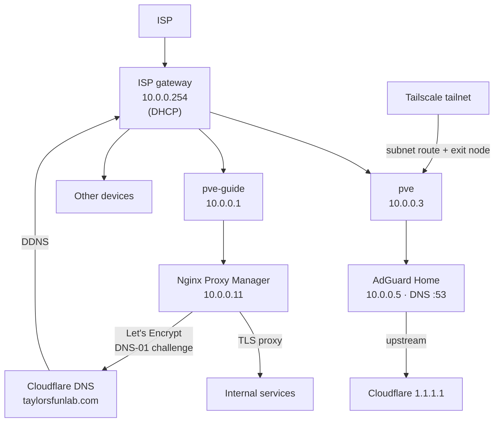

# Network

## Topology

It's a flat `/24` home network behind the ISP's gateway, with no VLANs. Addresses on this site are placeholders (`10.0.0.x`).

```mermaid
graph TD
    ISP["ISP"] --> Router["ISP gateway\n10.0.0.254\n(DHCP)"]
    Router --> PVE["pve\n10.0.0.3"]
    Router --> GUIDE["pve-guide\n10.0.0.1"]
    Router --> Devices["Other devices"]
    PVE --> AG["AdGuard Home\n10.0.0.5 · DNS :53"]
    AG -->|upstream| DNS["Cloudflare 1.1.1.1"]
    GUIDE --> NPM["Nginx Proxy Manager\n10.0.0.11"]
    NPM -->|TLS proxy| Services["Internal services"]
    CF["Cloudflare DNS\ntaylorsfunlab.com"] -->|DDNS| Router
    NPM -->|Let's Encrypt\nDNS-01 challenge| CF
    TS["Tailscale tailnet"] -->|subnet route + exit node| PVE
```

## DNS: AdGuard Home

- **Container:** CT 100 on `pve`
- **DNS port:** 53
- **Web UI:** port 80
- **Upstream DNS:** Cloudflare (1.1.1.1)
- **Jobs:** ad and tracker blocking, plus **DNS rewrites** that point internal hostnames at NPM, so LAN-only services never need a public DNS record

!!! note "Who actually uses AdGuard"
    The ISP gateway won't let its DHCP hand out a custom DNS server, so ordinary clients use the gateway's resolver by default. Every **server** guest is configured with AdGuard as its primary resolver and the gateway as a fallback. That way internal names resolve, and a DNS outage on CT 100 doesn't take the lab down with it. Moving DHCP onto AdGuard would bring the rest of the house under it.

## Reverse Proxy: Nginx Proxy Manager

- **Container:** CT 121 (portainer LXC) on pve-guide
- **IP:** 10.0.0.11

NPM terminates TLS for every web service with a wildcard certificate (`*.taylorsfunlab.com`) issued by Let's Encrypt through Cloudflare's DNS-01 challenge. Only ports 80 and 443 are forwarded from the internet.

### Proxy Hosts

NPM fronts the internal services that need TLS: dashboards, the cloud suite, the *arr admin UIs, the hypervisor UI, and the Jarvis HUD (which needs HTTPS for browser mic access). The exact hostnames and backends aren't published.

### Public vs LAN-only

Only services meant to be reachable from outside have public DNS records. Everything else resolves through an AdGuard rewrite on the LAN. A July 2026 audit removed public records that had pointed at private IPs.

## Dynamic DNS: Cloudflare

A Cloudflare DDNS container on CT 121 keeps the apex A record pointed at the home IP.

## Remote Access: Tailscale

`pve` runs Tailscale as a **subnet router** (advertising the LAN) and an **exit node**, so the whole lab is reachable from anywhere without opening extra ports. See [Tailscale](../services/network/tailscale.md).

## VPN: Gluetun

All download traffic on the mediaServer VM goes through a commercial VPN via Gluetun. qBittorrent, NZBGet, and Prowlarr run with `network_mode: service:gluetun`, so they have no direct internet access and can't leak traffic if the VPN drops.

## Fixed IPs

Every server guest has a fixed address: a static IP in the LXC config, or a pinned lease for the VMs. They were all re-pinned after the September 2026 move to a new ISP gateway. Critical LXCs (including the Claude agent in CT 102) use static configs so they don't depend on DHCP at boot.

| Host | IP | Type |
|---|---|---|
| pve-guide | 10.0.0.1 | Static |
| pve | 10.0.0.3 | Static |
| adguard CT | 10.0.0.5 | Static |
| mediaServer VM | 10.0.0.10 | Pinned lease |
| portainer CT | 10.0.0.11 | Static |
| nextcloud CT | 10.0.0.12 | Static |
| claude CT | 10.0.0.13 | Static |
| jellyfin CT | 10.0.0.14 | Static |
| immich CT | 10.0.0.15 | Static |
| guacamole CT | 10.0.0.16 | Static |
| amp-gameserver VM | 10.0.0.17 | Pinned lease |
| windows11 VM | 10.0.0.18 | Pinned lease |
| jarvis CT | 10.0.0.19 | Static |
| media CT | 10.0.0.20 | Static |
