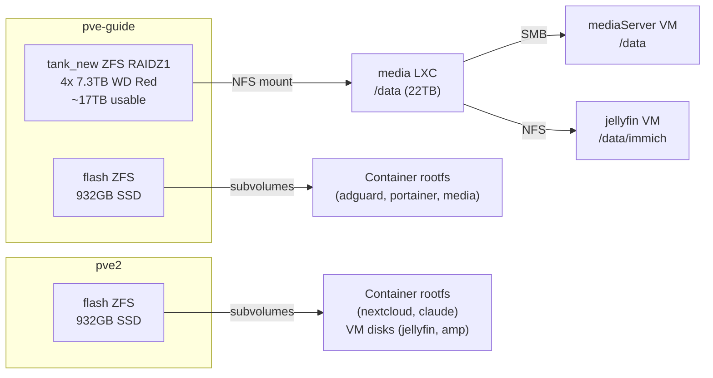

# Storage

## Overview

## Pools

### `tank_new` — Bulk Storage (pve-guide)

4x 7.3TB WD Red Pro drives in RAIDZ1. Can survive one drive failure. ~17TB usable capacity.

**Current usage:** 4.5TB / 12TB quota (38%)

The pool is exposed to the `media` LXC as a ZFS subvolume (`tank_new:subvol-200-disk-0`) mounted at `/data`. The media LXC then re-exports this via SMB and NFS to other VMs.

**Data layout inside `/data`:**

| Path | Contents |
|---|---|
| `/data/Movies` | 150+ movies |
| `/data/Shows` | 20+ TV series |
| `/data/Music` | Music library |
| `/data/books` | Book library |
| `/data/downloads` | qBittorrent + NZBGet staging |
| `/data/immich` | Immich photo library + DB |
| `/data/Nextcloud` | Nextcloud user data |
| `/data/servers` | Game server data (Crafty, AMP) |

### `flash` — Fast SSD Storage

Each node has an SSD pool named `flash` used for container rootfs and VM disks. ZFS subvolumes are created per-container for easy snapshotting.

| Node | Pool Size | Usage |
|---|---|---|
| pve-guide | 932GB | Container rootfs (adguard 4GB, portainer 24GB, media 800GB) + Docker volumes |
| pve2 | 932GB | Container rootfs (nextcloud 40GB, claude 32GB) + VM disks (jellyfin 64GB, amp 64GB) |

## NFS Exports

The media LXC exports data over NFS to other services:

- `192.168.1.118:/tank_new/subvol-200-disk-0/immich` → mounted in jellyfin VM at `/data/immich`

## Backup Strategy

!!! warning "Work in progress"
    Formal backup strategy is not fully implemented. Proxmox backup jobs should be configured for critical VMs and containers.

Current state:
- ZFS RAIDZ1 on `tank_new` provides drive-failure protection (not a backup)
- No off-site backup configured
