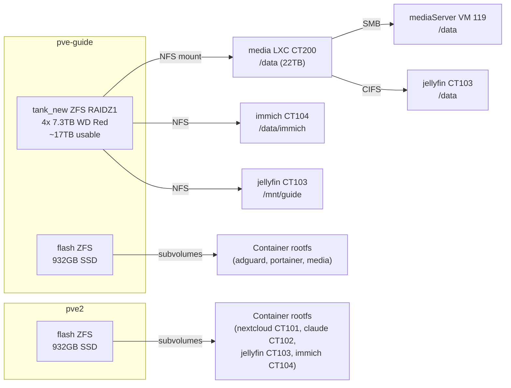

# Storage

## Overview

## Pools

### `tank_new` — Bulk Storage (pve-guide)

4x 7.3TB WD Red Pro drives in RAIDZ1. Can survive one drive failure. ~17TB usable capacity.

**Current usage:** 4.5TB / 12TB quota (38%)

The pool is exposed to the `media` LXC as a ZFS subvolume (`tank_new:subvol-200-disk-0`) mounted at `/data`. The media LXC re-exports this via SMB to other services.

**Data layout inside `/data`:**

| Path | Contents |
|------|----------|
| `/data/Movies` | 150+ movies |
| `/data/Shows` | 20+ TV series |
| `/data/Music` | Music library |
| `/data/books` | Book library |
| `/data/downloads` | qBittorrent + NZBGet staging |
| `/data/immich` | Immich photo library + DB |
| `/data/Nextcloud` | Nextcloud user data |
| `/data/servers` | Game server data (Crafty, AMP) |

### `flash` — Fast SSD Storage

Each node has an SSD pool named `flash` used for container rootfs and VM disks. ZFS subvolumes are created per-container for easy snapshotting.

| Node | Pool Size | Contents |
|------|-----------|----------|
| pve-guide | 932GB | Container rootfs: adguard (4GB), portainer (24GB), media (800GB) |
| pve2 | 932GB | Container rootfs: nextcloud CT101 (40GB), claude CT102 (32GB), jellyfin CT103 (64GB), immich CT104 (64GB), amp VM300 disk (64GB) |

> **Note:** VM 219 (jellyfin VM) disk was decommissioned 2026-04-10 after migration to CT 103 and CT 104. The zvol (`flash/vm-219-disk-0`) was retained briefly as a recovery source and can be destroyed once stability is confirmed.

## NFS Mounts

| Export (pve-guide) | Mounted In | Path |
|--------------------|-----------|------|
| `/tank_new/subvol-200-disk-0/immich` | CT 104 (immich) | `/data/immich` |
| `/tank_new/subvol-200-disk-0` | CT 103 (jellyfin) | `/mnt/guide` |

## SMB/CIFS Mounts

| Share (CT 200) | Mounted In | Path |
|----------------|-----------|------|
| `//192.168.1.200/data` | CT 103 (jellyfin) | `/data` |
| `//192.168.1.200/data` | VM 119 (mediaServer) | `/data` |

## Backup Strategy

!!! warning "Work in progress"
    Formal backup strategy is not fully implemented. Proxmox backup jobs should be configured for critical containers.

Current state:
- ZFS RAIDZ1 on `tank_new` provides drive-failure protection (not a backup)
- No off-site backup configured
