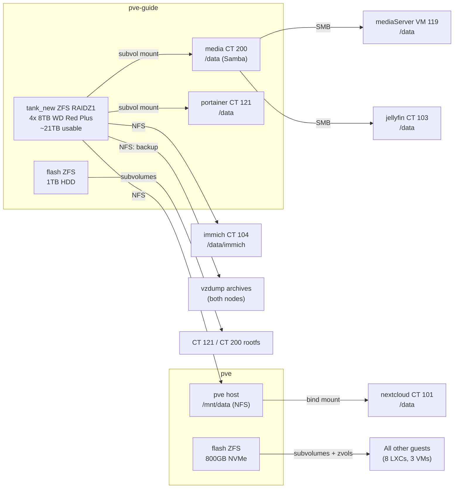

# Storage

## Overview

```mermaid
graph LR
    subgraph pve-guide
        TANK["tank_new ZFS RAIDZ1\n4x 8TB WD Red Plus\n~21TB usable"]
        FLASHG["flash ZFS\n1TB HDD"]
        MEDIA["media CT 200\n/data (Samba)"]
        PORT["portainer CT 121\n/data"]
    end

    subgraph pve
        FLASHP["flash ZFS\n800GB NVMe"]
        HOSTNFS["pve host\n/mnt/data (NFS)"]
    end

    TANK -->|subvol mount| MEDIA
    TANK -->|subvol mount| PORT
    MEDIA -->|SMB| MS["mediaServer VM 119\n/data"]
    MEDIA -->|SMB| JF["jellyfin CT 103\n/data"]
    TANK -->|NFS| IMMICH["immich CT 104\n/data/immich"]
    TANK -->|NFS| HOSTNFS
    HOSTNFS -->|bind mount| NC["nextcloud CT 101\n/data"]
    TANK -->|NFS: backup| BK["vzdump archives\n(both nodes)"]
    FLASHG -->|subvolumes| CTG["CT 121 / CT 200 rootfs"]
    FLASHP -->|subvolumes + zvols| CTP["All other guests\n(8 LXCs, 3 VMs)"]
```

## Pools

### `tank_new`: bulk storage (pve-guide)

4x 8TB WD Red Plus drives in RAIDZ1. It survives one drive failure, has about 21TB usable, and is roughly a third full.

The main dataset `tank_new:subvol-200-disk-0` (22TB quota) is mounted at `/data` in **both** CT 200 (which re-exports it over Samba) and CT 121 (for Crafty's game data). Sub-paths are also NFS-exported straight to `pve`.

**Data layout inside `/data`:**

| Path | Contents |
|------|----------|
| `/data/Movies` | Movie library |
| `/data/Shows` | TV library |
| `/data/music` | Music library |
| `/data/books` | Book library |
| `/data/downloads` | qBittorrent + NZBGet staging |
| `/data/immich` | Immich photo library + Postgres data |
| `/data/Nextcloud` | Nextcloud user data |
| `/data/servers` | Game server data (Crafty) |

A second dataset, `tank_new/backup`, holds the nightly vzdump archives. See [Backups](backups.md).

### `flash`: per-node guest storage

Each node has a pool named `flash` for container rootfs (ZFS subvolumes) and VM disks (zvols). Keeping the same name on both nodes makes cluster migrations straightforward.

| Node | Pool | Media | Contents |
|------|------|-------|----------|
| pve | 800GB | NVMe | Rootfs: adguard (4GB), nextcloud (40GB), claude (32GB), jellyfin (64GB), immich (64GB), guacamole (10GB), vaultwarden (8GB), jarvis (16GB). VM disks: mediaServer (64GB), amp (32GB), windows11 (64GB) |
| pve-guide | 1TB | HDD | Rootfs: portainer (24GB), media (≈1TB quota, mostly empty) |

## NFS Mounts (served by pve-guide)

| Export | Mounted In | Path |
|--------|-----------|------|
| `/tank_new/subvol-200-disk-0` | `pve` host → bind-mounted into CT 101 | `/mnt/data` → `/data` |
| `/tank_new/subvol-200-disk-0/immich` | CT 104 (immich) | `/data/immich` |
| `/tank_new/backup` | `pve` host (Proxmox storage `backup-nfs`) | `/mnt/pve/backup-nfs` |

## SMB/CIFS Mounts (served by CT 200)

| Share | Mounted In | Path |
|-------|-----------|------|
| `//10.0.0.20/data` | CT 103 (jellyfin) | `/data` |
| `//10.0.0.20/data` | VM 119 (mediaServer) | `/data` |

!!! tip "Mount resilience"
    Consumers of the network shares retry and remount automatically. A retry timer re-establishes Jellyfin's SMB mount if CT 200 comes up late after a power event. Immich can look like an **empty library** if its NFS mount is missing, so check `mountpoint /data/immich` first before debugging the app.

## Backups

Every guest is backed up nightly. See [Backups](backups.md).
