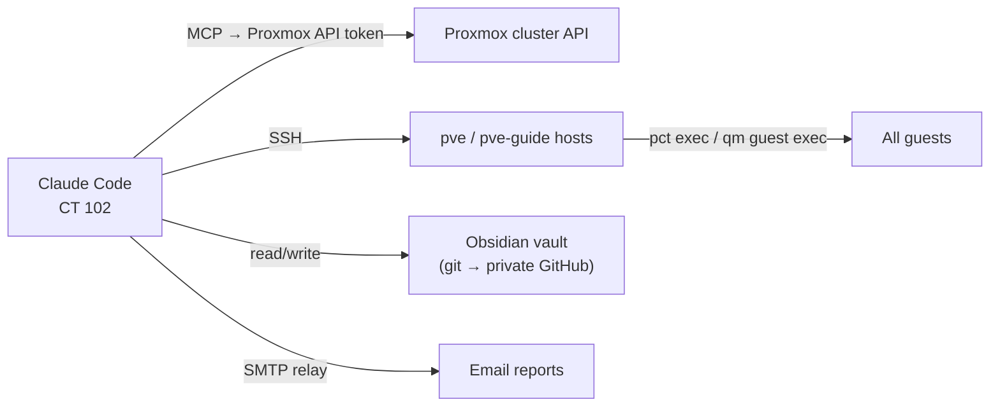

# Claude Code Agent

An in-cluster AI operator. [Claude Code](https://claude.com/claude-code) runs inside an LXC on the cluster and has API access to Proxmox, SSH to both nodes, and a long-term memory in markdown. It does most of the hands-on admin work in the lab and writes down everything it does.

## Setup

- **Host:** claude LXC (CT 102) on `pve`, `10.0.0.13` (static IP, with AdGuard plus the gateway as a DNS fallback so the agent survives a DNS outage)
- **LXC:** unprivileged Debian 12, 4 cores, 4GB RAM, 32GB rootfs
- **Billing:** runs on a flat Claude subscription. Headless `claude -p` calls are covered too, so the automations below have no per-token API cost

## What it can reach

- **Proxmox MCP server:** a fork of the open-source ProxmoxMCP project. It exposes guest listing, status, snapshots, backups, start/stop, and in-VM command execution as tools, authenticated with a dedicated API token.
- **Standing rules** in a project `CLAUDE.md`: always ask before stopping, deleting, or destroying a guest; never delete backups without approval; warn before touching running guests; show the plan before acting when in doubt.

## Long-term memory: the Obsidian vault

Every session ends with a log entry: what changed, why, what was tried and failed, and the result. They go into a git-tracked **Obsidian vault** of markdown notes.

- Notes are grouped by chapter (infrastructure, VM/CT operations, backups, projects, trading).
- An autolinker wraps mentions of known entities (`CT 104`, `pve-guide`, …) in wikilinks, so Obsidian's graph and backlinks build themselves.
- Each entity has a **hub note** with its current key facts, and log entries are the history behind it.
- The vault syncs nightly to a private GitHub repo and to Obsidian on the desktops.
- Future sessions **search the vault before claiming not to know something**, which is what makes it memory and not an archive.

This replaced a self-hosted Wiki.js in May 2026. The wiki still runs read-only as an archive of older entries.

## Scheduled automations

| Job | Schedule | What it does |
|---|---|---|
| Weekly health audit | Sundays | HTML email with SMART (ATA + NVMe wear), ZFS health and scrub age, node health, GPU temperature and Xid errors, Kuma availability and incidents, **backup freshness per guest**, and **monitoring-coverage gaps** |
| Vault sync | Nightly | Commits and pushes the vault |
| Morning brief | Weekday mornings | Personal daily briefing email |
| Trading bot sessions | Market hours | See [Trading Bots](trading-bot.md) |

The weekly audit's first run found that the cluster had **no backups at all**. That led to the [nightly backup jobs](../../infrastructure/backups.md) being set up the same day.

## Long-running services on CT 102

| Service | Purpose |
|---|---|
| Self-heal receiver | Takes Uptime Kuma webhooks and starts incident response. See [Self-Healing](self-healing.md) |
| Discord bot | [Byte](discord-bot.md): the agent, reachable from Discord |
| Jarvis gateway | The "brain" API behind the [Jarvis HUD](jarvis-hud.md) (agent runs + text-to-speech) |
| Wiki.js | Legacy wiki, read-only archive |

## Budget watchdog

Since everything shares one subscription, a hook checks the subscription's usage limits after tool calls. Near the limit it tells the running agent to stop starting new work and write a handoff file for the next session. Automated jobs such as self-healing skip the model entirely when usage is high and send a plain alert.
