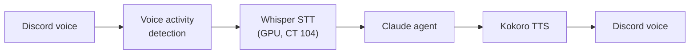

# Byte (Discord Agent)

**Byte** is a Discord bot backed by the same Claude Code agent that runs the cluster. It's a way to ask the lab questions or give it tasks from a phone. It also has a voice mode.

## Setup

- **Host:** `discord-bot.service` on the claude LXC (CT 102)
- **Library:** discord.py
- **Backend:** headless `claude -p` per message, run on the subscription (no API key)

## Modes

| Trigger | Behavior |
|---|---|
| Normal message | **Full agent run** with the same tools, rules, and memory as the terminal agent. It posts a "working…" message immediately, live-edits it with tool activity, and replaces it with the answer when done |
| `!chat …` | Fast, no-tools small talk with a lightweight model |
| `!deep …` | Uses the larger reasoning model |
| `!reset` | Starts a fresh conversation for that channel |
| `!join` / `!leave` | Joins or leaves a voice channel (see below) |

Each channel keeps its own agent session, resumed on every turn, so conversations have continuity across messages and restarts.

## Voice mode

Byte can sit in a Discord voice channel and hold a spoken conversation:

- **Speech-to-text:** a GPU Whisper service on the Immich container (CT 104), which already has the RTX A3000
- **Text-to-speech:** Kokoro, a local neural TTS model
- The same STT/TTS pieces power the [Jarvis HUD](jarvis-hud.md)

## Alerts channel

A second channel, `#homelab-alerts`, gets Uptime Kuma UP/DOWN notifications and [self-healing](self-healing.md) reports through a **channel webhook**. Alerts still arrive if the bot itself is down.

## Safety

- Only responds in a designated channel of a private server, and in DMs
- Per-user cooldown and a global concurrency cap
- Mass mentions (`@everyone` / `@here`) are stripped from output
- The same standing rules as the terminal agent apply: confirmation before destructive actions, and nothing that touches backups without approval
