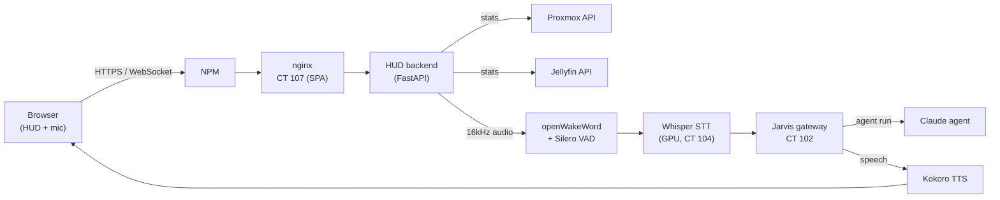

# Jarvis HUD

A sci-fi-style homelab dashboard with a built-in **"hey Jarvis"** voice assistant, made for a wall-mounted tablet or a spare monitor.

## Setup

- **Host:** jarvis LXC (CT 107) on `pve`, `10.0.0.19`
- **LXC:** unprivileged Debian 12, 4 cores, 3GB RAM, 16GB rootfs
- **Access:** LAN-only HTTPS through Nginx Proxy Manager, with an AdGuard DNS rewrite and **no public DNS record**. HTTPS is required because browsers only allow microphone access on secure origins

## Architecture

- **Frontend:** a single-page app served by nginx on CT 107, showing live cluster, guest, and media stats
- **Backend:** FastAPI (uvicorn) on CT 107. It pulls stats from the Proxmox and Jellyfin APIs and handles the voice WebSocket
- **Wake word + VAD:** openWakeWord (`hey_jarvis`) and Silero VAD, with a separate model instance for each browser session
- **Brain:** a small gateway service on CT 102 that runs the Claude agent (same tools and rules as the terminal agent) and returns Kokoro TTS audio

## Voice UX

- Say "hey Jarvis" to wake it. After that it stays in **conversation mode**, so follow-ups don't need the wake word, until a period of silence.
- The orb button has two stages. When awake, **stop listening** sends it back to waiting for the wake word. When idle, **turn off mic** fully disconnects and releases the microphone.

## Lessons learned

- WebSockets through NPM need *Websockets Support* enabled and longer timeouts. When testing with `curl`, force `--http1.1`, because HTTP/2 drops the upgrade headers and returns a misleading 404.
- Browser audio capture uses an AudioWorklet that resamples to 16kHz PCM before sending, which keeps the server side simple.
