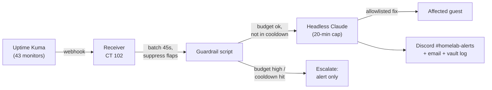

# Self-Healing

When a monitor goes down, a headless Claude Code session diagnoses the problem and, if the fix is on a short pre-approved list, applies it, verifies it, and reports back.

## Flow

1. **Receiver:** a small HTTP service on CT 102 collects Kuma alerts. It batches alerts that arrive together (for example, several services behind one failed mount) into a single incident, suppresses flapping monitors, and holds a global lock so only one heal runs at a time.
2. **Guardrails, enforced in code and not by the model:**
    - Skips the model when subscription usage is high, and sends a plain alert instead
    - **Per-monitor cooldown:** a 2nd heal within 2 hours, or a 3rd within 24 hours, escalates to a human
    - 20-minute hard timeout per session
3. **Claude** reads the incident, investigates over SSH and the Proxmox API, and matches it against runbooks.
4. **Action** only if it's on the allowlist. Otherwise it diagnoses and reports.

## The allowlist

Seven approved actions, each backed by a runbook:

1. Restart Jellyfin (CT 103)
2. Remount Immich's NFS share (CT 104)
3. Restart Immich's services (CT 104)
4. `docker restart` of specific named containers on the infrastructure LXC (CT 121)
5. Restart Tailscale
6. Restart Filebrowser on a node
7. Restart AdGuard Home (CT 100)

Each action runs at most once per incident.

**Always forbidden:** starting, stopping, rebooting, or destroying any VM, container, or node; package installs or updates; config-file edits; deleting data; removing containers or volumes; and anything touching the trading bots. Problems outside the list get a diagnosis and an escalation, not an improvised fix.

## Reporting

| Outcome | Discord | Email |
|---|---|---|
| **FIXED** (root-caused, fixed, verified) | ✓ | ✓ |
| **ESCALATE** (needs a human) | ✓ | ✓ |
| **FLAP** (recovered on its own before any action) | ✓ | — |

Every incident is also written to a one-line-per-incident ledger and a detailed vault note.

## Validation

It was tested on day one with both paths: a fake alert on a healthy service (correctly classed as a flap, no action), and a real stopped container (root-caused, restarted through the allowlist, verified, reported). In that live test the healer also noticed that the test itself pointed at the wrong port.

## Design notes

- The headless session runs with a **scoped permission mode and a project allowlist**, not a blanket "skip permissions" flag.
- Game-server monitors are excluded, because a stopped game server is usually intentional.
