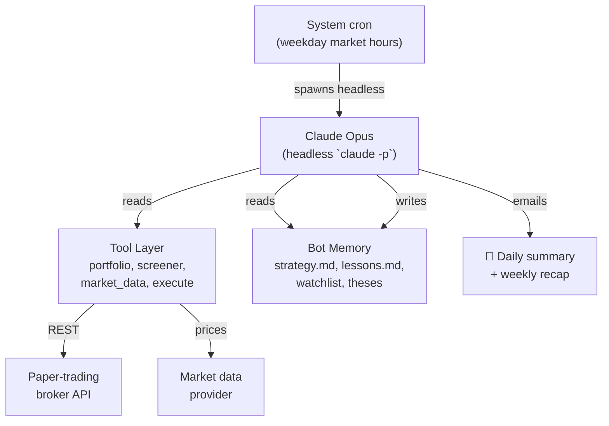

# Autonomous Trading Bot

A Claude-driven paper-trading bot that runs on a fixed market-hours schedule and self-manages its own strategy.

!!! info "Paper account only"
    The bot trades a paper account — no real capital is at risk. It exists primarily as a research project on autonomous LLM-driven decision making, not as a money-making vehicle.

## Architecture at a glance

## How it works

The bot is **not** a hardcoded algorithm. It's a sequence of constraints + tools, with the LLM as the decision layer:

1. **System cron** fires at fixed times during the trading day (pre-market, open, midday, pre-close, post-market — 5 sessions Mon–Fri).
2. Each tick spawns a **headless Claude Opus** that reads a session-specific protocol file.
3. Claude pulls the current portfolio + watchlist + market data via a **tool layer** (Python scripts under `~/trading/tools/`).
4. It then reasons about positions and either holds, opens, or closes — subject to **hard guardrails** (no shorts, no margin, must-set-stop, ≥2% cash buffer, no duplicates).
5. Trades go through a **paper-trading broker API**.
6. After the close, an email summary lands in the operator's inbox.

## Self-management

A unique design choice: the bot owns its own strategy. The file `strategy.md` (sizing, position count, stop policy, hold times, sector mix) is **revised by the bot itself once a week** based on what worked and what didn't. The hard guardrails above are enforced in code and *not* up for negotiation, but everything else is.

This means:

- Every Friday, a longer "weekly self-review" session runs.
- The bot reads its trade log, P&L, and `lessons.md`, then proposes rule changes to its own `strategy.md`.
- The next week trades against the updated rules.

## What's intentionally not in this doc

- The specific strategy class, parameters, signals, or position sizing logic
- Performance numbers, equity curve, or P&L
- Broker name, account details, or API references
- Locations of secrets, config, or tools

These are kept off the public site by design. The interesting part of this project is the *architecture* (LLM-as-decision-layer with hard guardrails + self-revising soft rules), not anything specific to the strategy.

## Stack

- **Orchestrator:** system cron on a Proxmox LXC
- **Brain:** headless Claude Opus invocations
- **Tool layer:** small Python scripts under `~/trading/tools/`
- **State:** plain Markdown files under `~/trading/memory/` (LLM-readable, version-controllable, diff-able)
- **Notifications:** email via local Postfix → Gmail SMTP relay
