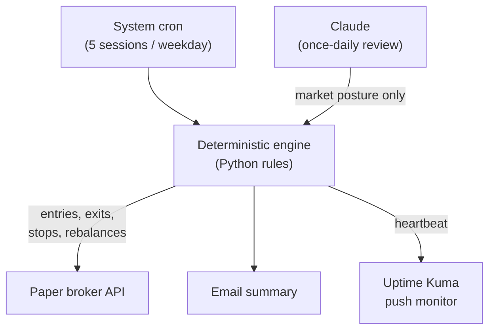

# Trading Bots

Two research projects on LLM-assisted trading. Both run on **paper accounts** and are scheduled on the Claude agent's LXC (CT 102).

!!! info "Paper accounts only"
    Both bots trade paper accounts, so no real capital is at risk. They're experiments in how far an LLM should be trusted in a decision loop, not money-makers.

## Maverick: equities

### v1: the LLM as trader (Apr–Jun 2026)

The first version had a headless Claude session as the **decision layer**. Cron started it five times per trading day, it read the portfolio, a screener, and its own memory files, and it placed trades through a tool layer with hard code-enforced guardrails (no shorts, no margin, mandatory stops, cash buffer). It even rewrote its own soft strategy rules every week.

**What happened:** it was fascinating to watch and consistently **lagged the S&P 500**. The LLM's picks lost more on losers than they made on winners, and two rounds of rule tuning didn't close the gap.

### v2: the LLM as analyst (Jun 2026 →)

The rebuild flipped the roles:

```mermaid
graph TD
    Cron["System cron\n(5 sessions / weekday)"] --> Engine["Deterministic engine\n(Python rules)"]
    Engine -->|entries, exits,\nstops, rebalances| Broker["Paper broker API"]
    LLM["Claude\n(once-daily review)"] -->|market posture only| Engine
    Engine --> Report["Email summary"]
    Engine -->|heartbeat| Kuma["Uptime Kuma\npush monitor"]
```

- **Coded rules** handle entries, sizing, stops, trailing exits, and a monthly momentum rebalance. Rules were back-tested before adoption with a pre-registered pass/fail test, and a config that failed its test wasn't shipped.
- **The LLM is an analyst.** A once-daily call sets a market posture. It doesn't pick trades.
- **Dead-man's switch:** every session pushes a heartbeat to Uptime Kuma, so a job that silently stops running raises an alert.

## nancy: options

A second, independent bot for **options premium-selling** research, with its own paper account and an always-on risk daemon. Lanes are switched on and off one at a time as experiments. A 0DTE lane was halted after a poor run, and a simpler put-write lane is now live. The same principles apply: coded risk limits, and the LLM only as an analyst writing a daily narrative.

## Lessons

- **An LLM as the trader underperformed an index fund.** An LLM as a reviewer on top of coded rules is much easier to reason about and test.
- **Silent failures are worse than loud ones.** Any error path that logs "market closed" and exits cleanly looks exactly like a normal quiet day. Session logs are checked for a positive "ran live" marker, not just the absence of errors.
- **There's no dry-run against a live broker.** Test order-path code with invalid inputs, never with real held positions.

## What's intentionally not in this doc

- The specific strategies, parameters, signals, or sizing logic
- Performance numbers, equity curves, or P&L
- Broker names, account details, or API references
- Locations of secrets, config, or tools

The interesting part is the architecture and what didn't work, not the strategy.
