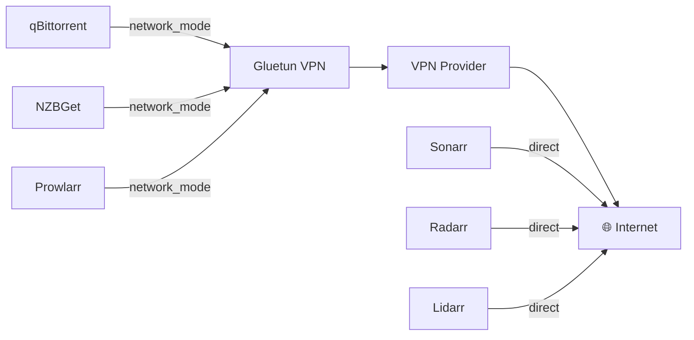

# The *arr Stack

Automated media management stack running on the mediaServer VM (ID 119). All download traffic is routed through a VPN via Gluetun.

## Services

| Service | Port | Role |
|---|---|---|
| **Sonarr** | 8989 | TV show management + renaming |
| **Radarr** | 7878 | Movie management + renaming |
| **Lidarr** | 8686 | Music management |
| **Bazarr** | 6767 | Subtitle management |
| **Prowlarr** | 9696 | Indexer aggregation (via VPN) |
| **Profilarr** | 6868 | Quality profile management |
| **Sportarr** | 1867 | Sports content |
| **qBittorrent** | 8080 | Torrent client (via VPN) |
| **NZBGet** | 6789 | Usenet client (via VPN) |
| **Gluetun** | — | VPN container |
| **Deunhealth** | — | Container health watchdog |

## Host

- **VM:** mediaServer (ID 119) on pve-guide
- **OS:** Ubuntu 24.04 LTS
- **IP:** 192.168.1.120
- **Resources:** 4 cores, 12GB RAM, 64GB SSD (OS)
- **Data mount:** `//192.168.1.200/data` (22TB, SMB from media LXC)
- **Compose file:** `/docker/servarr/compose.yaml`

## VPN Architecture



qBittorrent, NZBGet, and Prowlarr use `network_mode: service:gluetun` — they share the VPN container's network and have no internet access if the VPN drops. Sonarr, Radarr, and Lidarr connect directly (metadata only, no downloads).

Deunhealth monitors qBittorrent and automatically restarts it if it becomes unhealthy (e.g. VPN reconnect causes it to stall).

## Docker Compose

See the full compose file in the [compose directory](../../../compose/arr-stack/).

Key networking setup:

```yaml
networks:
  servarrnetwork:
    name: servarrnetwork
    ipam:
      config:
        - subnet: 172.39.0.0/24

services:
  gluetun:
    image: qmcgaw/gluetun
    cap_add:
      - NET_ADMIN
    devices:
      - /dev/net/tun:/dev/net/tun
    ports:
      - 8080:8080   # qBittorrent WebUI
      - 6881:6881   # qBittorrent torrent port
      - 6789:6789   # NZBGet
      - 9696:9696   # Prowlarr

  qbittorrent:
    network_mode: service:gluetun  # Routes all traffic through VPN
    depends_on:
      gluetun:
        condition: service_healthy

  sonarr:
    networks:
      servarrnetwork:
        ipv4_address: 172.39.0.3
```

## Data Flow

```
Download request (Sonarr/Radarr)
  → Prowlarr (finds release, via VPN)
  → qBittorrent or NZBGet (downloads, via VPN)
  → /data/downloads/
  → Sonarr/Radarr (imports, renames)
  → /data/Movies or /data/Shows
  → Jellyfin (picks up new content)
```

## Environment Variables

Copy `.env.example` and fill in your values:

```env
PUID=1000
PGID=1000
TZ=America/Chicago
VPN_SERVICE_PROVIDER=airvpn       # or your provider
VPN_TYPE=wireguard
WIREGUARD_PRIVATE_KEY=            # from your VPN provider
FIREWALL_VPN_INPUT_PORTS=         # forwarded port for qBittorrent
```
